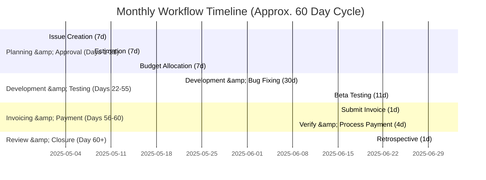
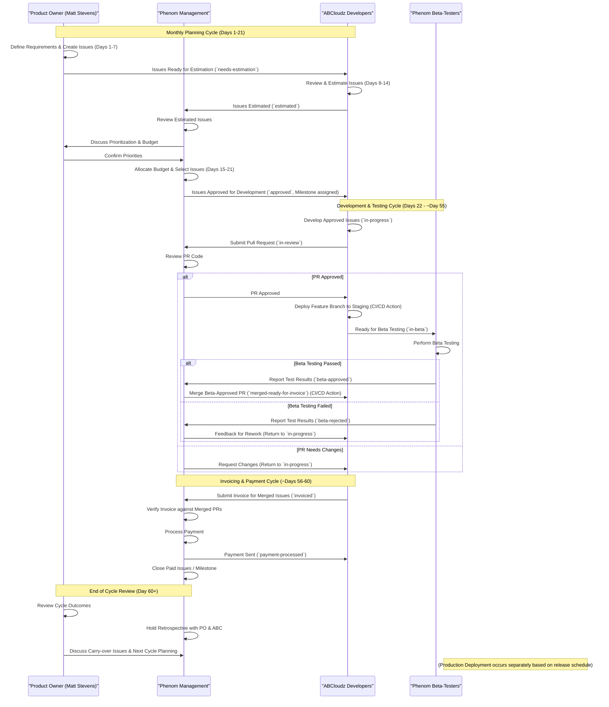

# GitHub Workflow: Point-Based Budget System for External Development

This document outlines a structured GitHub workflow for managing the ABCloudz team using a monthly point budget system. The workflow ensures that work is properly scoped, prioritized, and kept within budgetary constraints for Phenom LLC.

### Example Timeline (Gantt)

## Overview

- Phenom LLC maintains a monthly budget of story points
- ABCloudz assesses each issue and assigns point values
- Phenom approves and prioritizes issues within budget
- Work is tracked through GitHub issues, projects, and milestones
- Regular reporting ensures transparency and accountability

## Detailed Workflow

### 1. Repository Setup

#### 1.1 Repository Structure
- Main repository with clear README and contributing guidelines
- Issue templates for different types of work
- Branch protection rules to ensure code quality
- GitHub project board for visual workflow management

#### 1.2 Issue Templates
Create specialized templates for:
- Bug reports
- Feature requests
- Enhancement proposals
- Documentation updates

Each template should include fields for:
- Description
- Acceptance criteria
- Expected value
- Priority level (High/Medium/Low)
- Point estimation placeholder (to be filled by ABCloudz)

### 2. Monthly Planning Cycle

#### 2.1 Issue Creation Phase (Days 1-7)
- Phenom stakeholders create issues for the coming month
- Each issue contains detailed requirements and acceptance criteria
- Issues are labeled as "Needs Estimation"
- Issues are added to a "Pending Estimation" column in the project board

#### 2.2 Estimation Phase (Days 8-14)
- ABCloudz reviews new issues
- Team discusses and estimates effort using story points
- Team documents estimation rationale in issue comments
- Team updates issue with point estimate and moves to "Estimated" column
- Team adds the `estimated` label and removes `needs-estimation` label

#### 2.3 Budget Allocation Phase (Days 15-21)
- Phenom reviews all estimated issues
- Prioritizes issues based on business value and point cost
- Selects issues to be included in the monthly budget
- Adds selected issues to the current milestone
- Moves selected issues to "Approved for Development" column
- Adds `approved` label to selected issues

#### 2.4 Development Phase (Days 22 - Next Month Day 21)
- ABCloudz works on approved issues
- Updates progress through comments and project board movements
- Creates pull requests linked to issues
- Phenom reviews code changes
- Approved code is merged to beta branch for testing
- Beta testers review functionality against acceptance criteria 
- Only beta-approved changes are eligible for payment

### 3. Issue Workflow States

1.  **Needs Estimation** - New issue created, awaiting point estimation.
2.  **Estimated** - Points assigned, awaiting approval.
3.  **Approved for Development** - Selected for current budget cycle.
4.  **In Progress** - Currently being worked on.
5.  **In Review** - Pull request submitted, awaiting code review.
6.  **Beta Testing** - Feature branch deployed to staging/testing environment after PR approval.
7.  **Beta Approved** - Testing passed, PR ready to be merged.
8.  **Merged / Ready for Invoice** - PR merged into `main`/`develop` branch. Issue is now eligible for invoicing.
9.  **Invoiced** - Included in a submitted invoice.
10. **Paid** - Payment processed after verifying merge and invoice details.
11. **(Optional) Production Deployed** - Code deployed to production (tracked separately from invoicing).

### 4. Point Estimation Guidelines

#### 4.1 Fibonacci Point Scale
The team will use the Fibonacci sequence for point estimation (1, 2, 3, 5, 8, 13, 21):
(See: [What Are Story Points? by Mike Cohn](https://www.mountaingoatsoftware.com/blog/what-are-story-points))

- **1 Point**: Very simple task, typically **~30 minutes - 1 hour**
- **2 Points**: Simple task, typically **~1-2 hours**
- **3 Points**: Average complexity task, typically **~2-4 hours** (approx. half a day)
- **5 Points**: Complex task requiring deeper analysis, typically **~4-6 hours**
- **8 Points**: Very complex task spanning multiple components, typically **~1 day**
- **13 Points**: Major feature or complex integration, typically **~1.5-2 days**
- **21 Points**: Extremely complex task, typically **~3+ days** (should be broken down if possible)

The ABCloudz team needs to assess the expected cost of a typical issue estimated at a level of effort of 3 points.

#### 4.2 Standardized Pricing
To simplify budget planning and payment processing, a standardized price is established based on the value of a single point.
**Context:** This model combines standard Agile estimation (using story points for relative effort) with a fixed-price-per-unit billing approach. While not a universally standardized methodology with a single governing document, it aims to provide budget predictability by tying cost directly to estimated work units. Its success relies on consistent estimation practices and a clear contractual agreement between Phenom and ABCloudz. This approach relates to broader concepts discussed in Agile contracting and value-based pricing models.

**References on Agile Estimation &amp; Contracting:**
*   Agile Estimating and Planning Concepts: [https://www.atlassian.com/agile/project-management/estimation](https://www.atlassian.com/agile/project-management/estimation)
*   Agile Contracts Overview: [https://www.agilealliance.org/resources/agile-contracts-primer/](https://www.agilealliance.org/resources/agile-contracts-primer/)

- **1 Point** = $45 (Base reference price)
- **2 Points** = $90 (2 × $45)
- **3 Points** = $135 (3 × $45)
- **5 Points** = $225 (5 × $45)
- **8 Points** = $360 (8 × $45)
- **13 Points** = $585 (13 × $45)
- **21 Points** = $945 (21 × $45)

#### 4.3 Monthly Budget Calculation
For a monthly budget, determine the total number of points Phenom wants to allocate:

- If the average issue is 3 points and Phenom wants to complete approximately 20 issues per month, the monthly point budget would be 60 points.
- With the pricing above, this would equate to a monthly budget of $2,700 (60 points × $45 per point).

> Note: Issues estimated at 21 points or higher should generally be broken down into smaller, more manageable issues.
#### 4.4 Handling Bug Fixes for Prior Work

Bugs identified that are directly attributable to features or code previously developed and invoiced by ABCloudz should generally be addressed by ABCloudz without assigning new story points or incurring additional costs, provided they are reported within an agreed-upon warranty period (e.g., 30 days post-merge). These fixes are considered part of ensuring the quality of the original delivery.

New, unrelated bugs, or bugs found outside the warranty period for the original work, should be created as standard issues and follow the normal estimation, approval, and billing process outlined in this document.

### 5. Monthly Budget Management

#### 5.1 Budget Tracking
- Create a monthly milestone with a description that includes the point budget
- Add a "Monthly Budget" note in the project board showing:
  - Total budget points (e.g., 60 points per month)
  - Allocated points (points assigned to approved issues)
  - Remaining points (available for new issues)
  - Budget utilization percentage
  - Standard monetary value (based on the 3-point standard price)

#### 5.2 Budget Adjustment Process
If changes are needed mid-cycle:
1. Phenom creates an issue labeled `budget-adjustment`
2. The adjustment is discussed and approved by stakeholders
3. The budget tracking information is updated
4. Additional issues may be approved or postponed

### 6. GitHub Automation and Integration

#### 6.1 Recommended GitHub Actions
- Automated labeling based on issue content
- Point totaling for milestones and projects
- Status updates based on PR activities
- Slack/Teams notifications for workflow state changes

#### 6.2 Reporting Automation
Create a weekly report with:
- Current points used vs. budget
- Completion percentage of approved issues
- Burndown chart for the monthly cycle
- Preview of upcoming potential issues

### 7. Production Deployment and Payment Process

#### 7.1 Feature Branch Testing and Production Approval

This process, where features are tested in isolation on their own branches before being merged into the main codebase, aligns with industry best practices like **GitHub Flow** and **Continuous Integration/Continuous Deployment (CI/CD)**. This approach helps ensure the stability of the main codebase and allows for thorough testing without impacting other development work.

1.  When development on an issue is complete, the developer creates a Pull Request (PR) targeting the `main` or `develop` branch (as per project setup). The issue is marked with the `in-review` label.
  2. A Phenom representative reviews the code changes in the PR.
  3. Once the PR is approved, the **feature branch** itself is deployed to a staging or testing environment. The issue is marked with the `in-beta` label and moved to the "Beta Testing" column.
  4. Beta testers verify the changes on the **feature branch** meet the acceptance criteria. Test results are documented in the issue comments.
  5. If beta testing is approved, the issue gets the `beta-approved` label. The PR can then be merged into the main/develop branch.
  6. If beta testing fails, the issue gets the `beta-rejected` label and is returned to the "In Progress" state with feedback for the developer.
  7. Code that has passed beta testing and has its PR successfully merged into the `main`/`develop` branch is eligible for invoicing.

**References:**
*   GitHub Flow: [https://docs.github.com/en/get-started/using-github/github-flow](https://docs.github.com/en/get-started/using-github/github-flow)
*   Continuous Integration: [https://martinfowler.com/articles/continuousIntegration.html](https://martinfowler.com/articles/continuousIntegration.html)

#### 7.2 Invoicing and Production Deployment
- Only code that is beta-approved and successfully merged is eligible for invoicing and payment. Production deployment may happen subsequently.
- Production deployment process:
  1. **Invoicing:** Once a PR is merged after beta approval, the issue receives a `merged-ready-for-invoice` label (or similar).
  2. ABCloudz creates an invoice periodically (e.g., monthly) for all issues marked `merged-ready-for-invoice`.
  3. **Production Deployment:** Separately, the merged code is deployed to the production environment according to the project's release schedule. This may involve adding a `production-deployed` label for tracking, but it does not gate invoicing.
  5. Invoice references the specific GitHub issues by number and includes:
     - Issue ID and title
     - Point value for each issue
     - Monetary value calculated based on the standardized price
     - Total points and total monetary value
  4. Issues included in an invoice are marked with the `invoiced` label.

#### 7.3 Payment Processing
- Payment is only issued after verification of production deployment
- At the end of the invoicing period:
  1. Phenom verifies all invoiced issues correspond to successfully merged PRs.
  2. Phenom processes payment based on agreed-upon rate per point.
  3. Add `payment-processed` label to paid issues
  4. Close the associated issues or milestone

#### 7.3 Review and Retrospective
- Create a retrospective issue to discuss:
  - What went well
  - What could be improved
  - Point estimation accuracy
  - Budget adequacy
  - Beta testing effectiveness
  - Payment process efficiency

#### 7.4 Carry-over Process
For incomplete issues:
1. Assess remaining work and adjust points if needed
2. Decide whether to prioritize in next cycle
3. If carried over, add `carry-over` label
4. Include in next cycle's budget calculation

### 8. Example GitHub Project Board

| Backlog | Needs Estimation | Estimated | Approved | In Progress | In Review | Beta Testing | Beta Approved | Merged / Ready for Invoice | Invoiced | Paid | (Optional) Production Deployed |
|---------|------------------|-----------|----------|-------------|-----------|--------------|---------------|----------------------------|----------|------|--------------------------------|
| Future issues | Awaiting points | Has points, awaiting approval | Approved within budget | Currently being worked on | PR submitted, awaiting review | Feature branch deployed for testing | Testing passed, ready to merge | PR merged, eligible for invoice | Included in invoice | Payment processed | Code live in production |

### 9. Example Monthly Timeline

- **Days 1-7**: Phenom creates issues for next month
- **Days 8-14**: ABCloudz estimates points for all new issues
- **Days 15-21**: Phenom approves issues within budget
- **Days 22-51**: Development work (overlapping with next cycle's planning)
- **Days 45-55**: Beta testing and PR Merging (after beta approval)
- **Day 56**: ABCloudz submits invoice for merged issues
- **Days 57-60**: Phenom verifies merge and invoice details, then processes payment
- **Day 60**: Monthly retrospective and cycle closure
> **Note on Cycle Length:** While the end-to-end process for a single batch of work (from creation to payment) spans approximately 60 days as shown above, the workflow operates on overlapping monthly cycles. Planning for the next month begins on Day 1 while the previous month's development is still in progress.

## Implementation Instructions

### Setting Up This Workflow

1. **Create Labels**:
   - `needs-estimation`
   - `estimated`
   - `approved`
   - `in-progress`
   - `in-review`
   - `in-beta`
   - `beta-approved`
   - `beta-rejected`
   - `merged-ready-for-invoice`
   - `production-deployed` (Optional: for tracking deployment status separately from invoicing)
   - `invoiced`
   - `payment-processed`
   - `budget-adjustment`
   - `carry-over`
   - Point values: `points-1`, `points-2`, `points-3`, `points-5`, `points-8`, `points-13`, `points-21`

2. **Configure Project Board**:
   - Create columns matching the updated states described in section 8 (including "Beta Approved", "Merged / Ready for Invoice", etc.)
   - Add automation for issue/PR movements

3. **Create Issue Templates**:
   - Add templates with estimation fields
   - Include checklists for acceptance criteria

4. **Set Up Milestone Template**:
   - Monthly milestone with budget in description
   - Due date aligned with monthly cycle

5. **Document Process**:
   - Add this workflow to the repository's CONTRIBUTING.md
   - Create onboarding documentation for ABCloudz

## Workflow Diagrams

### Role-Based Workflow (Swimlane)

## Conclusion

This workflow provides a structured approach for Phenom LLC to manage the ABCloudz team within budget constraints while maintaining flexibility, transparency, and accountability. By following this process, Phenom can effectively track work, manage costs, and ensure consistent value delivery from ABCloudz.
