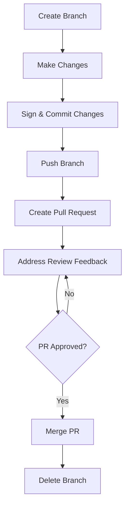
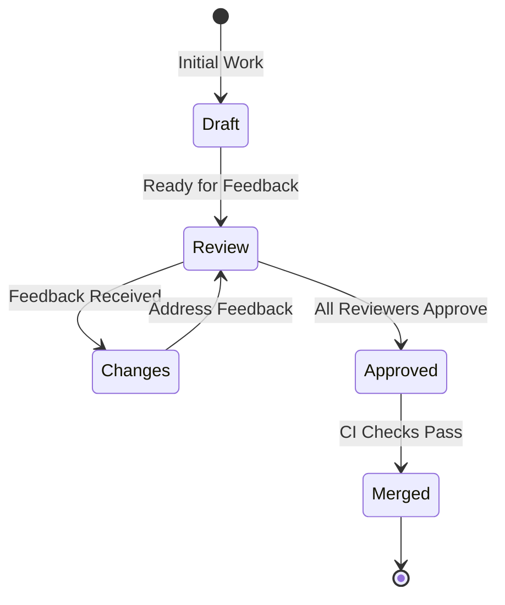

# Phenom Earth GitHub Flow

This document outlines our collaborative development process at Phenom Earth, detailing how we use GitHub to manage our projects and ensure code quality and security.

## Prerequisites

Before contributing to Phenom Earth repositories, ensure you have:

- A GitHub account connected to the Phenom Earth organization
- Git configured on your local machine
- Commit signing set up (required for all contributions)
- Necessary access permissions to the relevant repositories

## Setting Up Commit Signing (Required)

All commits to Phenom Earth repositories **must be signed**. This enhances security by verifying the identity of contributors.

### GPG Key Setup

1. Generate a GPG key if you don't have one:
   ```bash
   gpg --full-generate-key
   ```

2. List your keys to find your key ID:
   ```bash
   gpg --list-secret-keys --keyid-format=long
   ```

3. Configure Git to use your key:
   ```bash
   git config --global user.signingkey YOUR_KEY_ID
   git config --global commit.gpgsign true
   ```

4. Add your GPG key to GitHub:
   - Export your public key: `gpg --armor --export YOUR_KEY_ID`
   - Go to GitHub → Settings → SSH and GPG keys → New GPG key
   - Paste your public key and save

### SSH Key Setup (Alternative)

1. Generate an SSH key if needed:
   ```bash
   ssh-keygen -t ed25519 -C "your_email@example.com"
   ```

2. Configure Git to use SSH for signing:
   ```bash
   git config --global gpg.format ssh
   git config --global user.signingkey ~/.ssh/id_ed25519.pub
   git config --global commit.gpgsign true
   ```

3. Add your SSH key to GitHub:
   - Go to GitHub → Settings → SSH and GPG keys → New SSH key
   - Paste your public key and save

## Phenom Earth GitHub Workflow



### 1. Create a Branch

Always create a new branch for your changes. Use a descriptive name following our convention:

```
[type]/[short-description]
```

Where `type` is one of:
- `feat`: New feature
- `fix`: Bug fix
- `docs`: Documentation changes
- `style`: Formatting changes
- `refactor`: Code restructuring
- `test`: Adding or modifying tests
- `chore`: Maintenance tasks

Examples:
- `feat/add-sensor-detection`
- `fix/login-crash-android`
- `docs/update-installation-guide`

```bash
git checkout main
git pull origin main
git checkout -b feat/your-feature-name
```

### 2. Make Changes

Make your changes in your branch, following our coding standards and guidelines:
- Write clean, readable code with appropriate comments
- Follow the style guide for the specific project
- Write tests for new functionality
- Ensure all tests pass locally

### 3. Sign and Commit Your Changes

Every commit must be signed. Make meaningful commits with clear messages:

```bash
# Make sure signing is enabled
git config --global commit.gpgsign true

# Commit with a meaningful message
git commit -S -m "feat: Add sensor calibration function for iOS devices"
```

Commit message format:
```
[type]: [Short description]

[Longer description if needed]

[Issue reference if applicable]
```

### 4. Push Your Branch

Push your branch to the remote repository:

```bash
git push origin your-branch-name
```

### 5. Create a Pull Request

Create a pull request on GitHub:
1. Go to the repository on GitHub
2. Click "Pull requests" → "New pull request"
3. Select your branch
4. Fill in the PR template with details about your changes
5. Request reviews from appropriate team members



### 6. Address Review Comments

- Respond to all review comments
- Make requested changes in new commits
- Push updates to the same branch
- Re-request reviews as needed

### 7. Merge Your Pull Request

Once approved and all CI checks pass, merge your pull request:
1. Choose the appropriate merge method (usually "Squash and merge")
2. Ensure the squash commit message follows our format
3. Confirm the merge

### 8. Delete Your Branch

After merging, delete your branch to keep the repository clean:
- GitHub offers to delete the branch after merging
- Or delete manually: `git branch -d your-branch-name`

## Protection Rules

Our repositories enforce the following protection rules:
- All commits must be signed
- Pull requests require at least one approval
- Status checks must pass before merging
- Branches must be up to date before merging
- Force pushes to protected branches are disabled

## Troubleshooting

### Commit Signing Issues

If your commits aren't showing as verified:
1. Check that your email in Git matches the one associated with your GPG or SSH key
2. Verify your key is properly added to GitHub
3. Ensure signing is enabled in your Git config

For help with commit signing or other GitHub workflow questions, contact the Phenom Earth development team lead.
